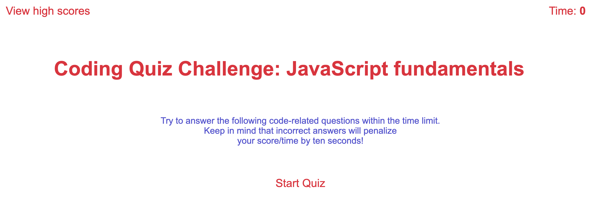

# Computer Trivia

## Description of the project
This mini timed computer Trivia is a fun game in which players have to guess the answers of 5 multiple-choice questions. If player selects a wrong answer 10 seconds will be subtracted from player's time. The game is over when the timer reaches zero or all questions get asnwered by the player. When the game is done player has the option to save their score in local memory. 

## Technologies used
* HTML
* CSS
* JavaScript

## Mockup

## Link URL to deployed website
https://sanam1060.github.io/trivia/

